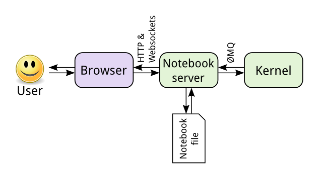

### Overview

1. [Research Software Engineering][rse-tuos] team?
1. [JupyterHub][jupyterhub-docs] on [ShARC][sharc-docs]: 
    1. What are these things?
    1. Why should I care?
    1. What works?
    1. What will work (hopefully) soon?

[jupyterhub-docs]: https://jupyterhub.readthedocs.io/en/latest/ "JupyterHub documentation"
[rse-tuos]: http://rse.shef.ac.uk/ "University of Sheffield's Research Software Engineering (RSE) team"
[sharc-docs]: http://docs.hpc.shef.ac.uk/en/latest/sharc/ "ShARC computer cluster"

### [Research Software Engineering][rse-tuos]?

New team at TUOS.  Can help with:

* **Faster code**: Interpreted and compiled languages; CUDA, parallelism 
* **GPU computing**: NVIDIA GPU Research Centre; FLAME/FLAME GPU ABM, Deep Learning, courses 
* **High Performance Computing** (HPC): TUOS clusters, **cloud**, software installs, training, advice  

[rse-tuos]: http://rse.shef.ac.uk/ "University of Sheffield's Research Software Engineering (RSE) team"

* **Software engineering**: automated, robust, open, accessible, user friendly and reproducible code 
* **Increasing research impact**: Make software open, citable and discoverable 
* **Grant support**: e.g. [Leverhulme Linguistics][dagmar-project] grant
* **Supporting lecturers**: Courses, tutorials, local or cloud computing resources

[dagmar-project]: http://rse.shef.ac.uk/blog/linuistics_grant_2016/

* **Support of site-licensed research software**: e.g. Mathworks, Microsoft, Wolfram Research, Intel, NVIDIA, Maplesoft, NAG
* **Training, outreach and education**: e.g. [Software Carpentry][soft-carp]

[soft-carp]: https://software-carpentry.org/lessons/

Can often help for free! 

See [https://rse.shef.ac.uk][rse-tuos] 

[rse-tuos]: http://rse.shef.ac.uk/ "University of Sheffield's Research Software Engineering (RSE) team"

### Who are we?

Paul Richmond, Twin Karmakharm, Mozhgan Kabiri Chimeh

Mike Croucher, Tania Allard, Will Furnass

**Not researchers, not technicians: RSEs!**

### Literate programming

Note:

* Jupyter Notebooks
    * runnable documents 
    * browser as REPL
    * code snippets 
    * viewed and manipulated from a web browser. 
    * encapsulating, presenting and sharing a coding-oriented workflow. 
* A Notebook comprises a column of cells, where each cell can contain:
    * some code or
    * explanatory text (that can be formatted using Markdown) and/or mathematical expressions (formatted using MathJax).
* When a code cell is executed by the user it can return anything renderable by a modern web browser:
* a single value,
* a table of data,
* a figure or
* a mathematical expression.

### Why is Jupyter useful?

* Exploratory, incremental analysis
* Live demos
* Encapsulate research narrative: reproducible workflow
    * Executable journal papers?
* Teaching: tutorials and assessments

### Jupyter Architecture

Note:

* Kernel can support any lang
* Notebook server can be on another machine
    * High-spec group server, cloud service or local HPC?

### Running the Jupyter server elsewhere: ShARC

* e.g. on a **HPC cluster**: more cores/RAM; GPU; distribute tasks to worker nodes
* [ShARC](https://docs.hpc.shef.ac.uk/en/latest/sharc/): new TUOS HPC cluster
    * General nodes: 98x, 16 cores / node (w/ AVX2, FMA); 4 GB RAM / core
    * GPU nodes: 8x NVIDIA Tesla K80 / node
    * Big memory nodes: 256GB RAM (16 GB / core)
    * RSE big memory nodes: 768GB RAM (64 GB / core)
    * RSE NVIDIA DGX-1: 8x NVIDIA Pascal P100 GPUs
    * 100 Gbps node interconnects

### JupyterHub

* Easily start Jupyter servers on remote machines!
* On SHARC/Iceberg:
    1. User logs in via web browser using TUOS username/password 
    1. User request to start a Jupyter server
        1. JupyterHub 'spawns' a server using a ShARC/Iceberg job
        1. and waits for the job to start
    1. User is transparently connected to their new Jupyter server
    1. User starts writing/running notebooks
    1. User can switch (conda) env / kernel using Jupyter UI

### Current status

* Public service on [https://jupyter.shef.ac.uk](https://jupyter.shef.ac.uk) (Iceberg)
* Private beta on [https://jupyter-sharc.shef.ac.uk](https://jupyter-sharc.shef.ac.uk) (ShARC)
* Cannot yet request non-default resources for Jupyter job
    * Want web UI for requesting CPU cores, RAM, GPUs, multiple worker nodes etc.
* JupyterHub services need making more resilient
* Want access to beta on ShARC?  Get in touch!

<!-- OpenDreamKit -->

Funding: [Horizon 2020][h2020] European [Research Infrastructure][eu-res-infra] project
with the aim of *furthering the open-source computational mathematics ecosystem*

Other exciting, related [OpenDreamKit][odk] work:

* [nbdime][nbdime]: graphical Notebook diff/merge tool
* [nbval][nbval]: Notebook regression testing/validation tool

[odk]: http://opendreamkit.org/ 
[h2020]: https://ec.europa.eu/programmes/horizon2020/
[eu-res-infra]:_https://ec.europa.eu/programmes/horizon2020/en/h2020-section/european-research-infrastructures-including-e-infrastructures
[nbdime]: https://nbdime.readthedocs.io/en/latest/
[nbval]: https://github.com/computationalmodelling/nbval

### To summarise

1. The RSE team are here to help
1. Being able to run Jupyter Notebooks on remote, powerful hardware is exciting
1. We should be able to do so on TUOS's clusters in a flexible, robust way fairly soon

Any questions?
