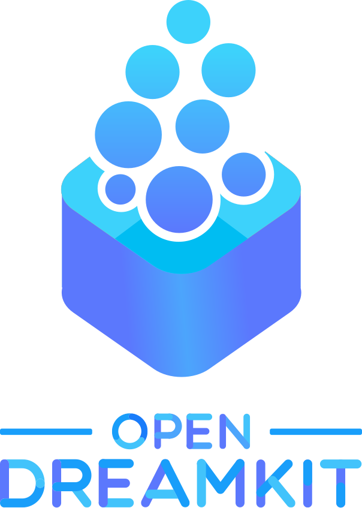

### Overview

1. [Research Software Engineering][rse-tuos] team?
1. [JupyterHub][jupyterhub-docs] on [ShARC][sharc-docs]: 
    1. What are these things?
    1. Why should I care?
    1. What works?
    1. What will work (hopefully) soon?

[jupyterhub-docs]: https://jupyterhub.readthedocs.io/en/latest/ "JupyterHub documentation"
[rse-tuos]: http://rse.shef.ac.uk/ "University of Sheffield's Research Software Engineering (RSE) team"
[sharc-docs]: http://docs.hpc.shef.ac.uk/en/latest/sharc/ "ShARC computer cluster"

### [Research Software Engineering][rse-tuos]?

New team at TUOS.  Can help with:

* **Faster code**: Interpreted and compiled languages; CUDA, parallelism 
* **GPU computing**: NVIDIA GPU Research Centre; FLAME/FLAME GPU ABM, Deep Learning, courses 
* **High Performance Computing** (HPC): TUOS clusters, **cloud**, software installs, training, advice  

[rse-tuos]: http://rse.shef.ac.uk/ "University of Sheffield's Research Software Engineering (RSE) team"

* **Software engineering**: automated, robust, open, accessible, user friendly and reproducible code 
* **Increasing research impact**: Make software open, citable and discoverable 
* **Grant support**: e.g. [Leverhulme Linguistics][dagmar-project] grant
* **Supporting lecturers**: Courses, tutorials, local or cloud computing resources

[dagmar-project]: http://rse.shef.ac.uk/blog/linuistics_grant_2016/

* **Support of site-licensed research software**: e.g. Mathworks, Microsoft, Wolfram Research, Intel, NVIDIA, Maplesoft, NAG
* **Training, outreach and education**: e.g. [Software Carpentry][soft-carp]

[soft-carp]: https://software-carpentry.org/lessons/

Can often help for free! 

See [https://rse.shef.ac.uk][rse-tuos] 

[rse-tuos]: http://rse.shef.ac.uk/ "University of Sheffield's Research Software Engineering (RSE) team"

### Who are we?

Paul Richmond, Twin Karmakharm, Mozhgan Kabiri Chimeh

Mike Croucher, Tania Allard, Will Furnass

**Not researchers, not technicians: RSEs!**

### Literate programming

<!-- OpenDreamKit -->

Funding: [Horizon 2020][h2020] European [Research Infrastructure][eu-res-infra] project
with the aim of *furthering the open-source computational mathematics ecosystem*

Other exciting, related [OpenDreamKit][odk] work:

* [nbdime][nbdime]: graphical Notebook diff/merge tool
* [nbval][nbval]: Notebook regression testing/validation tool

[odk]: http://opendreamkit.org/ 
[h2020]: https://ec.europa.eu/programmes/horizon2020/
[eu-res-infra]:_https://ec.europa.eu/programmes/horizon2020/en/h2020-section/european-research-infrastructures-including-e-infrastructures
[nbdime]: https://nbdime.readthedocs.io/en/latest/
[nbval]: https://github.com/computationalmodelling/nbval

### To summarise

1. ?
1. ?
1. ?

Any questions?
